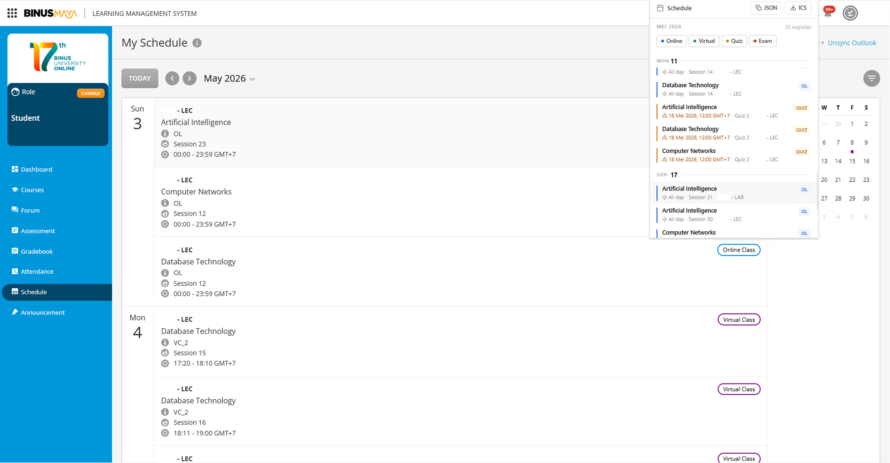

# BINUS Schedule

<p align="center">
  
</p>

A Chrome extension that displays your Binusmaya class schedule in a clean, minimal interface. Scrapes schedule data directly from the LMS and presents it with type-based filtering, instant search, and calendar export.

## Features

- **Schedule viewer** with day-grouped layout and color-coded event types
- **Type filters** for Online Class, Virtual Class, Quiz, and Exam
- **Auto-scroll** to today's events on load
- **ICS export** compatible with Google Calendar, Outlook, and Apple Calendar
- **JSON copy** for programmatic access and integrations
- **Offline cache** (5-minute TTL) for fast popup reloads
- **Error recovery** with retry when content script is unreachable

## Installation

1. Clone this repository
2. Open `chrome://extensions` in your browser
3. Enable **Developer mode** (top right)
4. Click **Load unpacked** and select the project folder

## Usage

1. Navigate to [Binusmaya Schedule](https://lms.binus.ac.id/lms/schedule)
2. Click the extension icon in your toolbar
3. Your schedule appears filtered and grouped by day

## Project Structure

```
binus-schedule/
├── manifest.json        Extension manifest (MV3)
├── popup.html           Popup markup
├── popup.css            Styles
├── popup.js             Popup UI controller (ES module)
├── src/
│   ├── constants.js     Type definitions and shared config
│   ├── icons.js         Lucide-style SVG icon helpers
│   ├── export.js        ICS and JSON export utilities
│   ├── storage.js       chrome.storage.local cache wrapper
│   └── content.js       Binusmaya DOM scraper
└── icons/               Extension icons (16/48/128)
```

## Architecture

The extension follows a modular ES module architecture:

- **content.js** runs in the Binusmaya page context, scrapes the schedule DOM, deduplicates quiz/exam entries, and responds to message requests from the popup.
- **popup.js** is the entry point for the popup UI. It imports from shared modules, renders the schedule, handles filtering and export, and manages view transitions.
- **constants.js** centralizes event type definitions (`online`, `virtual-class`, `quiz`, `exam`) and their associated CSS class mappings.
- **export.js** generates RFC 5545 compliant ICS files with VTIMEZONE for Asia/Jakarta and 15-minute reminder alarms for due-date items.
- **storage.js** provides a TTL-based cache layer over chrome.storage.local for instant popup loads.

## Contributing

1. Fork the repository
2. Create a feature branch (`git checkout -b feature/your-feature`)
3. Make your changes
4. Ensure no console errors in the popup and content script
5. Submit a pull request with a clear description

### Guidelines

- Follow the existing module structure and naming conventions
- Add JSDoc comments for new functions and types
- Test on the actual Binusmaya schedule page before submitting

## Tech Stack

- Chrome Extension Manifest V3
- Vanilla JavaScript (ES modules)
- CSS custom properties
- chrome.storage.local API

## License

MIT License. See [LICENSE](LICENSE) for details.